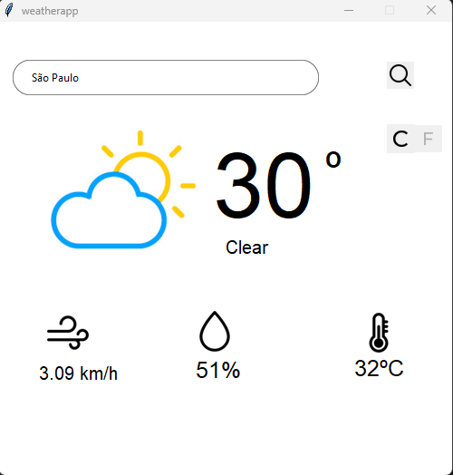

# weatherappPython

## Sobre esse projeto 💡

Projeto independente desenvolvido em python com intuito de aprender mais sobre o consumo de api

#### <strong>Status: </strong>Concluído ✔️

# Tecnologias utilizadas 💻

- [X] Python
- [X] Figma
- [X] TkinterDesigner
- [X] Api Openweather

# Comentários Finais 🎂

Esse projeto foi muito muito para o meu aprendizado em python, nele tive o desafio de criar uma aplicação desktop que pudesse consumir uma api de clima para informar ao usuário o grande desafio porém foi construir uma interface intuitiva em python, então por meio do TkinterDesigner pude desenvolver uma interface intuitiva e de qualidade para o usuário, e por ultimo o figma, que serviu para eu espandir meus conhecimentos na criação de bons designs para projetos.

# Autor

- Github - [@RodrigoCotrin](https://github.com/RodrigoCotrin/)
- Linkedin - [@RodrigoCotrin](https://www.linkedin.com/in/rodrigocotrin/)

***
[MIT LICENSE](https://github.com/RodrigoCotrin/weatherappPython/blob/main/LICENSE)
